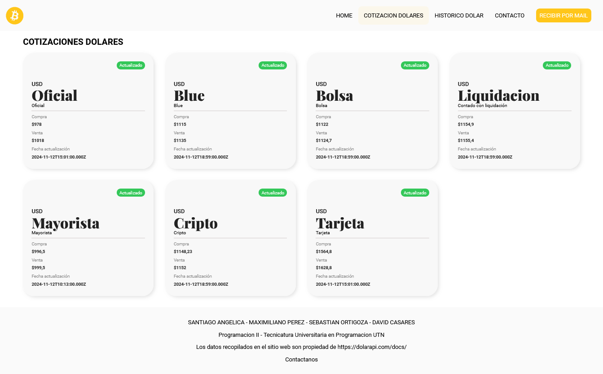
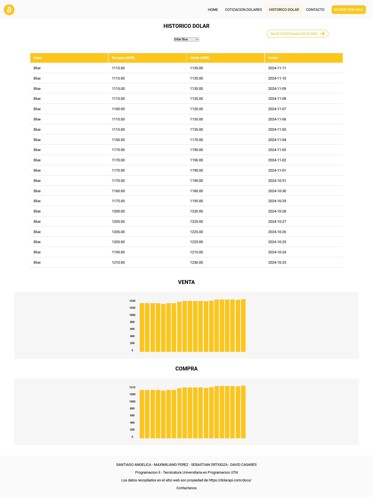

# Proyecto Integrador
*Programación II | Tecnicatura Universitaria en Programación | Universidad Tecnológica Nacional*

El proyecto final de Programación II consiste en que los estudiantes desarrollen una
página web completa utilizando las tecnologías HTML, CSS, JavaScript y Flask.
Durante un período de 14 semanas, los alumnos trabajarán de manera progresiva
para construir un sitio web funcional y estilizado, que demuestre su comprensión
de los conceptos clave del desarrollo web frontend y backend. Este proyecto
permitirá a los estudiantes aplicar sus conocimientos adquiridos a lo largo del
curso, creando una aplicación web dinámica y personalizable.
## Tabla de contenidos

- [Descripción General](#descripcion-general)
  - [Consigna](#consigna)
  - [Screenshots](#screenshots)
  - [Links](#links)
- [Proceso](#proceso)
  - [Tecnologías](#tecnologias)
  - [Implementaciones adicionales](#implementaciones-adicionales)
- [Integrantes](#integrantes)

## Descripción General

### Consigna

Requerimientos funcionales:

- El sitio web debe tener una pantalla principal (HOME) con todas las cotizaciones actualizadas ✅
- El sitio web debe tener una pantalla de históricos (HISTÓRICO) donde muestra a) una gráfica y b) una tabla de una moneda a elección con el rango de tiempo a elección ✅
- El sitio web debe indicar en todas las pantallas si los datos están actualizados o no (si provienen de la base de datos SQlite o de la API externa) 🛠
- El sitio web debe tener una forma de enviar los datos de la pantalla al mail del usuario solicitado en un formulario (tipo pop-up) ✅
- El sitio web debe tener un menú de navegación en todas las pantallas que indique en qué pantalla se encuentra el usuario ✅
- El sitio web debe tener un pie de página en todas las pantallas que incluya los integrantes, el nombre de la materia, la carrera, la universidad y la referencia a la API externa ✅

Requerimientos no funcionales:

- El sitio web debe ser responsivo ✅
- El sitio web debe ser público (no requiere autenticación de usuarios) ✅
- Cada consulta, reload, navegación entre páginas, debe durar menos de 0.5 segundos. ✅

### Screenshots

### Links

- Repositorio: [Repositorio](https://github.com/SantiAngelica/TPFinal-PROGRAMACION-22-)

## Proceso

### Tecnologías

- HTML5/CSS3
- Flexbox
- CSS Grid
- Diseño responsivo (Mobile | Tablet | Desktop)
- JavaScript
- Python
- Flask
- Email.js (librería)

### Implementaciones adicionales

- Las pantallas de cotizaciones e históricos permiten envíar los datos actualizados de la API al email ingresado por el usuario. Adicionalmente, estos datos podrían formatearse como tabla o esquema para una mayor legibilidad para el usuario.

- El formulario de contacto es a fines ilustrativos: la funcionalidad de contacto no se encuentra implementada al no ser requisito obligatorio de la aplicación, aunque queda pendiente para futuras mejoras.

- Los datos que se muestran en la aplicación se obtienen de nuestra API que hace de intermediario con DolarAPI. Estos datos están siempre actualizados, sin embargo podría implementarse la base de datos SQLite, que maneje los estados de los datos (si están actualizados o no), y los devuelva al Front End.

## Integrantes

- Santiago Angelica - [Santiago Angelica](https://github.com/SantiAngelica)
- David Casares - [David Casares](https://github.com/DavidCasares-vg)
- Maximiliano Pérez - [Maximiliano Pérez](https://github.com/MaximilianoLeonel23)
